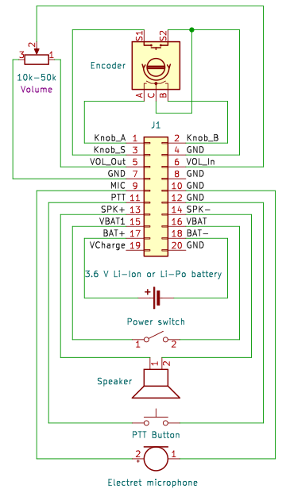

# Hardware version 2.2

## Overview

The Gekkokapula kit currently includes:
* Gekkokapula PCB v2.2
* Display module
* Pin header for display module
* 2 U.FL-SMA cables

To build a complete radio, you will additionally need:
* Enclosure
* Speaker
* Quadrature encoder (may be added to kit in future)
* Electret microphone (may be added to kit in future)
* 1S Li-Ion (or 3S NiMH) battery
* PTT button (optional)
* Volume potentiometer (optional)
* Power switch (optional)
* Serial Wire Debug adapter (to update firmware)

Most of these parts are connected to header J1 on the Gekkokapula PCB.
Schematic diagram of wiring between header J1 and other parts:

It is a good idea to connect the battery last after connecting
everything else. This reduces the risk of accidental short circuits
during construction.

## Detailed information

### Gekkokapula board
The Gekkokapula PCB contains most of the electronics.
All SMD components are already placed on the board, so
you only need to hand solder some through hole pin headers.
All bigger and more "mechanical" parts are wired to these
pin headers. This lets you choose any enclosure
you like and arrange all the knobs, buttons and connectors
the way you like.

### Display
Solder 8-pin female header to J9 on Gekkokapula board
and plug display module into the header.

The display is a
[128x160 RGB TFT module with an 8-pin header](https://www.ebay.com/itm/403774302965).

These display modules also include an SD card slot
but it is not used for anything in Gekkokapula.
The 4-pin SD card header J10, however, can be placed and used for
additional mechanical support and ground pins.

### Encoder
The most important part of the user interface is a quadrature
encoder with a push button.
Connect one as shown in the wiring diagram above.

### Speaker
Connect a speaker between SPK+ and SPK- pins
(pins 13 and 14 on header J1).
Almost any speaker should work.
A 4 Ω or 8 Ω speaker with a power handling of at least 1 W
is recommended.

Keep in mind that most speakers need an enclosure to work properly.
A small speaker without an enclosure may sound too quiet.

### Microphone
Connect an electret microphone capsule between MIC and GND
(pins 9 and 10 on header J1).
Most electret microphones should work here.

### Battery
The board includes a protection circuit and a charger for a single
cell Li-Ion or Li-Po battery with a nominal voltage of 3.6 or 3.7 V.
For example, a flat cellphone battery or a 18650 cell can be used.

Connect battery between BAT+ and BAT- pins
(pins 17 and 18 on header J1). Note that battery minus is not
directly connected to ground (because of the protection circuit).

Although designed for Lithium batteries, the circuit also works
with 3 NiMH cells in series, since their voltages are
[close enough](https://www.ti.com/lit/an/slyt468/slyt468.pdf)
to 1S Li-Ion.

### Charging
The battery charger works with any supply voltage from 4 V to 9 V
between VCharge pin and GND (pins 19 and 20 on header J1).

5 V from a USB port or a cellphone charger works fine.

### RF connections
All RF connectors on the board are U.FL. Use pigtail cables
to adapt them to your favourite RF connectors.

13 cm band has its own connector, J3. It is used for
receiving and transmitting in the 2300-2900 MHz range.
All lower frequency bands (13 MHz to 1.45 GHz) use the
connector J5.

J4 is not connected by default but the board can be
[modified to make it an RX connector](#separate-connectors-for-rx-and-tx).

J6 (CLKOUT) is currently unused but may be used in future as a reference
frequency output for transverters.

## Optional parts

### PTT button
A PTT button is optional since transmitting can be also started
from the "menu" using the encoder.

If you prefer to have a dedicated button for PTT, connect one
between PTT and GND (pins 11 and 12 on header J1).

### Power switch
A power switch is optional since there is software and hardware
support for a sleep mode which reduces current consumption
to a few µA.

If you prefer to have a "real" power switch, connect a toggle
switch between PWSW pins (pins 15 and 16 on header J1).

If a switch is not used, connect pins 15 and 16 directly together.

### Volume potentiometer
A volume potentiometer is optional since volume can be also
adjusted from the "menu" using the encoder.

If you prefer to have a dedicated knob for volume, connect
a potentiometer between pins 5, 6 and 7 on header J1
as illustrated on the silkscreen.
Resistance of the potentiometer should be something from
10 kΩ to 50 kΩ.

If a potentiometer is not connected, connect pins 5 and 6
together. Volume can be also reduced by adding a fixed
series resistor or a voltage divider here.

## Bugs
PCB v2.1 has its RF switch control lines swapped.
This can be fixed by moving series resistors
R76 and R77 to cross the lines.
This has been fixed in version 2.2.

Sometimes the board does not power up after battery has been
connected. Seems like the battery protection chip ends up in
some state where it disconnects the battery. If this happens,
try momentarily shorting GND and BAT- together to bypass the
protection circuit. Usually it starts working and keeps working
as long as battery is kept connected.

Silkscreen marking of one expansion header pin in wrong in
both v2.1 and v2.2: pin 2 of J2 is marked as GND but is
actually connected to VBAT.

## Advanced use and modifications

### Updating firmware and debugging
The EFR32 chip on the board is flashed through
Serial Wire Debug (SWD). The board has a 10-pin header with
[Cortex Debug standard pinout](https://documentation-service.arm.com/static/5fce6c49e167456a35b36af1)
but using 2.54 mm pitch instead of the standard 1.27 mm pitch
(to make it easier to solder wires or connectors to it).

GND, SWCLK and SWDIO pins are required and shall be connected to
corresponding pins on your SWD adapter.

The VDD pin is an output meant for SWD adapters with a reference
voltage input (used for level shifters or target detection).
If your SWD adapter does not have a reference voltage input,
leave the VDD pin unconnected. Using this VDD pin to supply power
to the Gekkokapula board is not recommended.

If your SWD adapter has a 5 V output pin, it can be used to supply
power to the board by connecting 5 V to pin 16 on J1
(power switch pin).
If you have a battery connected, you can also connect 5 V
to pin 19 on J1 (VCharge) to charge the battery.

Any SWD adapter supported by OpenOCD should work but may need
additional configuration for OpenOCD.
I can try to add configuration for more adapters
if you can give me an adapter to test with.

See [flashing tutorial](../firmware/flashing.md) for details
on installation and use of flashing software.

### Using without battery
If you want to directly use an external power supply and bypass
battery protection and charging circuits, connect the supply
between power switch VBAT pin (pin 16 on J1) and ground
(such as pin 20 on J1).

The circuit can handle supply voltages from 3 V to 6 V.
Keep in mind that a higher voltage will result in higher power
dissipation in 3.3 V regulator and audio amplifier chips.
Recommended range is between 3.5 V and 5.0 V to keep voltage
regulator working and to keep its dissipation reasonable.

### Headphone connector
Output of the audio power amplifier is bridged, so neither end of
the speaker is connected to ground.

If you want to add a headphone jack, it may be more convenient to
connect one end of headphones to ground, particularly if you use
a 4-pin headset connector with a microphone pin. This can be done
but an additional DC blocking capacitor is needed.
Series resistors are also recommended to protect the audio amplifier
from short circuits.

TODO: diagram showing additional circuitry for a headphone jack

### Use on bands other than 13 cm and 70 cm
The board includes a low-pass filter (LPF) for the 70 cm band.
This is needed to suppress transmitter harmonics and receiver
harmonic mixing products.
RF matching circuits are also optimized for 70 cm but will
work on other bands with somewhat reduced transmit power
and receive sensitivity.

For use on other bands, the LPF should be bypassed
(by moving C82 and R78) and an external LPF should be
connected between J5 and an antenna.
Receiving lower bands without modification or external
filtering is possible but the receiver is prone to harmonic
mixing if a proper LPF is not used. This means you may hear
spurious responses from higher frequencies, such as
FM broadcast signals when trying to listen to HF,
or 70cm band signals when trying to listen to 2m.

### Separate connectors for RX and TX
J4 can be used as a separate receiving connector for frequencies
below 1.45 GHz. This can be useful with an external power amplifier,
low noise amplifier or a transverter.
To use J4, move capacitor C74 to connect receiving chain to J4
through TP5 (and to disconnect it from the RX/TX switch).

On 2300-2900 MHz, J3 is always used for both TX and RX.
Separate connectors for 13 cm are not available.

### Changing charging current
Charge current is limited to approximately 400 mA.
If you want to change the current limit, check the
[data sheet of the charger chip](https://datasheetspdf.com/pdf-file/1090540/NanJingTopPower/TP4054/1)
and change resistor R2 value.

### Expansion header
Header J2 gives access to different supply voltages,
TX/RX switch controls and some free EFR32 pins.
These could be used to control an additional power amplifier
or switched band filters. No such expansions exist at the moment
but they might be developed in the future.

During transmission, TX_EN (pin 19) is high (at 3.3 V) and
RX_EN pin (pin 17) is low (at 0 V).
During reception, TX_EN is low and RX_EN is high.
These pins can be used to control an external power amplifier
and RX/TX switching.

VDD (pin 3) is directly connected to output of a 3.3 V regulator
that powers most of the components on the board.
VDDS (pin 5) is VDD through a power switch that turns off when
the board is in sleep mode. These pins can be used to supply
a few tens of milliamperes for external logic.

DVDD (pin 7) is the output from an EFR32 internal switching
regulator used to supply some parts of the EFR32 chip.
Powering external circuits from this pin is not recommended
since maximum current draw has not been determined yet.

VBAT (pins 1 and 2) are battery voltage output pins.
These can be used to supply an external power amplifier.

PA0, PA1, PB11 and PB12 are free for use by expansion boards.
PB11 and PB12 might be used in future for an I2C bus.
For example, an I2C I/O expander could be used to add more I/O
pins to control a band switch.
PA0 and PA1 were used for an UART in some old firmware versions
but the pins are currently unused.

PA2 is connected on the board for battery voltage measurement
and PA5 for battery charge detection. These features are currently
unimplemented in firmware, so the pins have been brought to the
header to allow using them for other purposes as well.
If you want to use them for something else, remove jumpers
R1 (for PA5) and R13 (for PA2) from the board.

Free EFR32 pins could be even used to interface some external
sensors or a computer, allowing some "IoT" or "modem" kind of
applications. I have no plans for such expansions at the moment
but anything is possible. Feel free to experiment!
